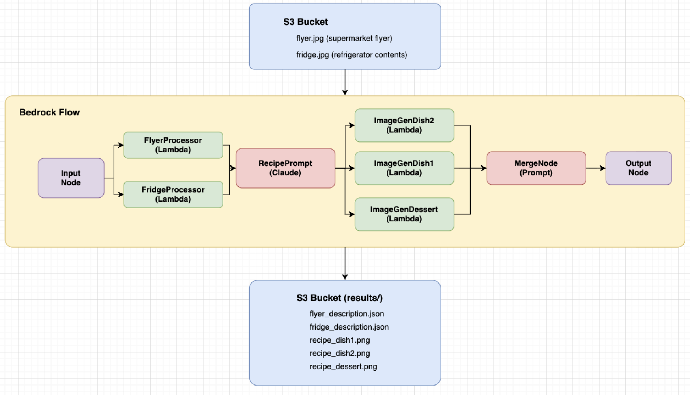

# FridgeFlyer

[English](README.md)

冷蔵庫の中身とスーパーのチラシ画像からAIがレシピを提案するサーバーレスアプリケーション。

## 概要

`FridgeFlyer`は、Amazon Bedrock FlowsとClaude Opus 4.6の画像認識機能を活用して：

1. **冷蔵庫の中身を分析** - 冷蔵庫の写真から食材を自動認識
2. **チラシの特売品を抽出** - スーパーのチラシから商品情報を抽出
3. **レシピを提案** - 冷蔵庫の食材と特売品を組み合わせた3品のレシピを生成
4. **レシピ画像を生成** - Nova Canvasで料理の完成イメージを生成
5. **HTMLで出力** - 見やすいレシピページを自動生成

## 機能

- **AI画像分析**: Claude Opus 4.6による高精度な食材・商品情報の抽出
- **レシピ生成**: 冷蔵庫の食材を活かし、買い足しを最小限にしたレシピ提案
- **画像生成**: Nova Canvasによる料理の完成イメージ生成
- **HTML出力**: レスポンシブなレシピページの自動生成
- **Infrastructure as Code**: AWS CDK（TypeScript）でデプロイ
- **サーバーレス**: LambdaとBedrock Flowsによるスケーラブルな構成

## アーキテクチャ



## 前提条件

- 適切な認証情報で設定済みのAWS CLI
- Node.js 18.x以上
- Python 3.10以上（boto3がインストール済み）
- AWS CDK CLI (`npm install -g aws-cdk`)
- AWSアカウントでBedrockのClaudeモデルアクセスが有効化済み

## インストール

```bash
git clone https://github.com/your-username/fridge-flyer.git
cd fridge-flyer/cdk
npm install
```

## デプロイ

```bash
cd cdk

# 初回のみ: CDKのブートストラップ
cdk bootstrap

# スタックをデプロイ
cdk deploy
```

### Flowバージョンの更新（再デプロイ時）

CDKを再デプロイした後は、新しいFlowバージョンを作成してAliasを更新する必要があります：

**cdk/update_alias.sh**

```bash
# Flow IDを取得
FLOW_ID=$(aws cloudformation describe-stacks \
  --stack-name FridgeFlyerStack \
  --query "Stacks[0].Outputs[?OutputKey=='FlowId'].OutputValue" \
  --output text)

ALIAS_ID=$(aws cloudformation describe-stacks \
  --stack-name FridgeFlyerStack \
  --query "Stacks[0].Outputs[?OutputKey=='FlowAliasId'].OutputValue" \
  --output text)

# 新しいバージョンを作成
VERSION=$(aws bedrock-agent create-flow-version \
  --flow-identifier "$FLOW_ID" \
  --query "version" \
  --output text)

# Aliasを新しいバージョンに更新
aws bedrock-agent update-flow-alias \
  --flow-identifier "$FLOW_ID" \
  --alias-identifier "$ALIAS_ID" \
  --name live \
  --routing-configuration "[{\"flowVersion\":\"$VERSION\"}]"

echo "Flow updated to version $VERSION"
```

## 使用方法

### クイックスタート（推奨）

Pythonスクリプトを使用して、簡単にレシピを生成できます。

#### 1. 画像を準備

`recipe/`ディレクトリに以下の画像を配置：
- `flyer.jpg` - スーパーのチラシ画像
- `fridge.jpg` - 冷蔵庫の中身の画像

#### 2. スクリプトの設定

`recipe/generate_recipe.py`の定数を環境に合わせて更新：

```python
FLOW_ID = "<CloudFormation出力のFlowId>"
FLOW_ALIAS_ID = "<CloudFormation出力のFlowAliasId>"
BUCKET_NAME = "fridge-flyer-<your-account-id>"
```

Flow IDとAlias IDは以下で確認できます：
```bash
aws cloudformation describe-stacks \
  --stack-name FridgeFlyerStack \
  --query "Stacks[0].Outputs" \
  --output table
```

#### 3. スクリプトを実行

```bash
cd recipe
python3 generate_recipe.py
```

#### 4. 出力を確認

処理が完了すると、自動的にブラウザでレシピページが開きます。

生成されるファイル：
| ファイル | 説明 |
|---------|------|
| `recipe/results/result.md` | 生成されたレシピ（Markdown） |
| `recipe/results/recipe_dish1.png` | 料理1の生成画像 |
| `recipe/results/recipe_dish2.png` | 料理2の生成画像 |
| `recipe/results/recipe_dessert.png` | デザートの生成画像 |
| `recipe/output/index.html` | レシピページ（HTML） |

### AWS CLIでの使用方法

Pythonスクリプトを使わず、AWS CLIで直接Flowを呼び出すこともできます。

#### 1. 画像をS3にアップロード

```bash
aws s3 cp flyer.jpg s3://fridge-flyer-<your-account-id>/
aws s3 cp fridge.jpg s3://fridge-flyer-<your-account-id>/
```

#### 2. Bedrock Flowを実行

```bash
FLOW_ID="<出力されたFlowId>"
ALIAS_ID="<出力されたFlowAliasId>"

aws bedrock-agent-runtime invoke-flow \
  --region ap-northeast-1 \
  --flow-identifier "$FLOW_ID" \
  --flow-alias-identifier "$ALIAS_ID" \
  --inputs '[{"content":{"document":"start"},"nodeName":"FlowInputNode","nodeOutputName":"document"}]'
```

#### 3. 結果を確認

```bash
aws s3 ls s3://fridge-flyer-<your-account-id>/results/
aws s3 sync s3://fridge-flyer-<your-account-id>/results/ ./results/
```

## 出力ファイル

### S3に保存されるファイル

| ファイル | 説明 |
|---------|------|
| `results/flyer_description.json` | チラシから抽出した商品リスト |
| `results/fridge_description.json` | 冷蔵庫から抽出した食材リスト |
| `results/recipe_dish1.png` | 料理1の生成画像 |
| `results/recipe_dish2.png` | 料理2の生成画像 |
| `results/recipe_dessert.png` | デザートの生成画像 |

### JSON出力形式

```json
{
  "source_bucket": "fridge-flyer-123456789012",
  "source_key": "flyer.jpg",
  "description": "チラシから抽出された商品リスト...",
  "model_id": "global.anthropic.claude-opus-4-6-v1"
}
```
* 生成されたHTMLのレビュー（上）


* 生成されたHTMLのレビュー（中）


* 生成されたHTMLのレビュー（下）


* 生成されたHTMLのレビュー（冷蔵庫の内容一覧）


* 生成されたHTMLのレビュー（チラシの内容一覧）


## 設定

`cdk/lib/fridge-flyer-stack.ts`を編集してカスタマイズ：

| パラメータ | 説明 | デフォルト値 |
|-----------|------|-------------|
| `SOURCE_KEY` | 入力画像ファイル名 | `flyer.jpg` |
| `MODEL_ID` | 使用するClaudeモデル | `global.anthropic.claude-opus-4-6-v1` |
| `IMAGE_MODEL_ID` | 画像生成モデル | `amazon.nova-canvas-v1:0` |
| `bucketName` | S3バケット名パターン | `fridge-flyer-${ACCOUNT_ID}` |
| `temperature` | レシピ生成の多様性 | `0.9` |

## プロジェクト構成

```
fridge-flyer/
├── cdk/
│   ├── bin/cdk.ts                    # CDKアプリエントリポイント
│   ├── lib/fridge-flyer-stack.ts     # メインスタック定義
│   ├── lambda/
│   │   ├── image-processor/
│   │   │   └── index.py              # 画像分析Lambda（Claude）
│   │   └── image-generator/
│   │       └── index.py              # レシピ画像生成Lambda（Nova Canvas）
│   ├── package.json
│   ├── tsconfig.json
│   └── cdk.json
├── recipe/
│   ├── generate_recipe.py            # レシピ生成スクリプト
│   ├── flyer.jpg                     # チラシ画像（サンプル）
│   ├── fridge.jpg                    # 冷蔵庫画像（サンプル）
│   ├── results/                      # 生成結果
│   └── output/                       # HTML出力
├── images/
│   └── architectured.png             # アーキテクチャ図
├── README.md
├── README.ja.md
└── LICENSE
```

## 必要要件

- Python 3.10以上（boto3）
- Node.js 18.x以上
- AWS CDK 2.x
- Bedrockアクセスが有効なAWSアカウント
  - Claude Opus 4.6（グローバル推論）
  - Claude 3 Haiku
  - Nova Canvas

## ライセンス

MITライセンス - 詳細は[LICENSE](LICENSE)を参照してください。

## 著者

SIN

## コントリビューション

プルリクエストを歓迎します。大きな変更を行う場合は、まずIssueを作成して変更内容について議論してください。
