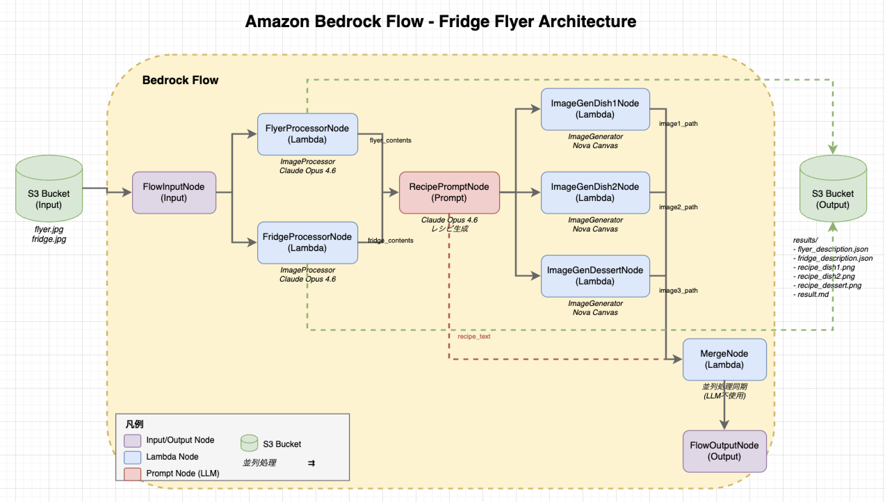
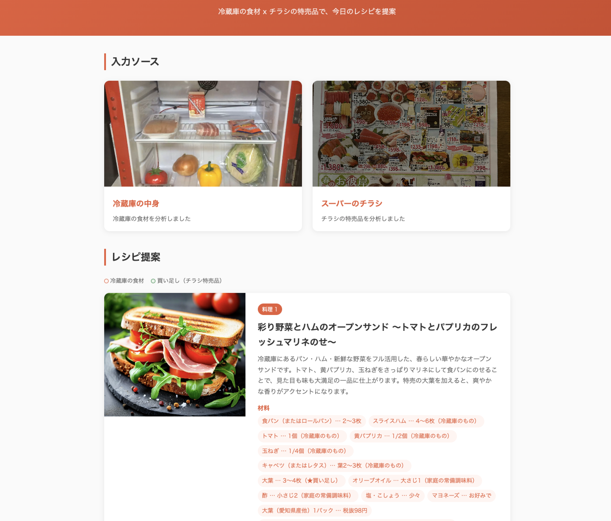
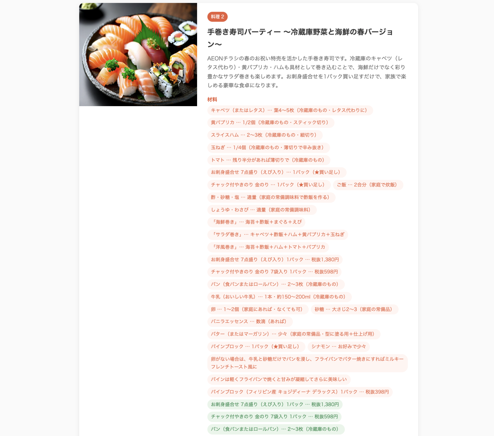
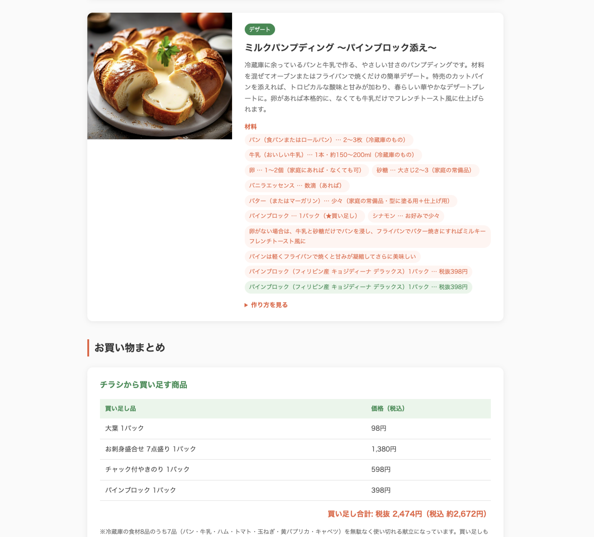
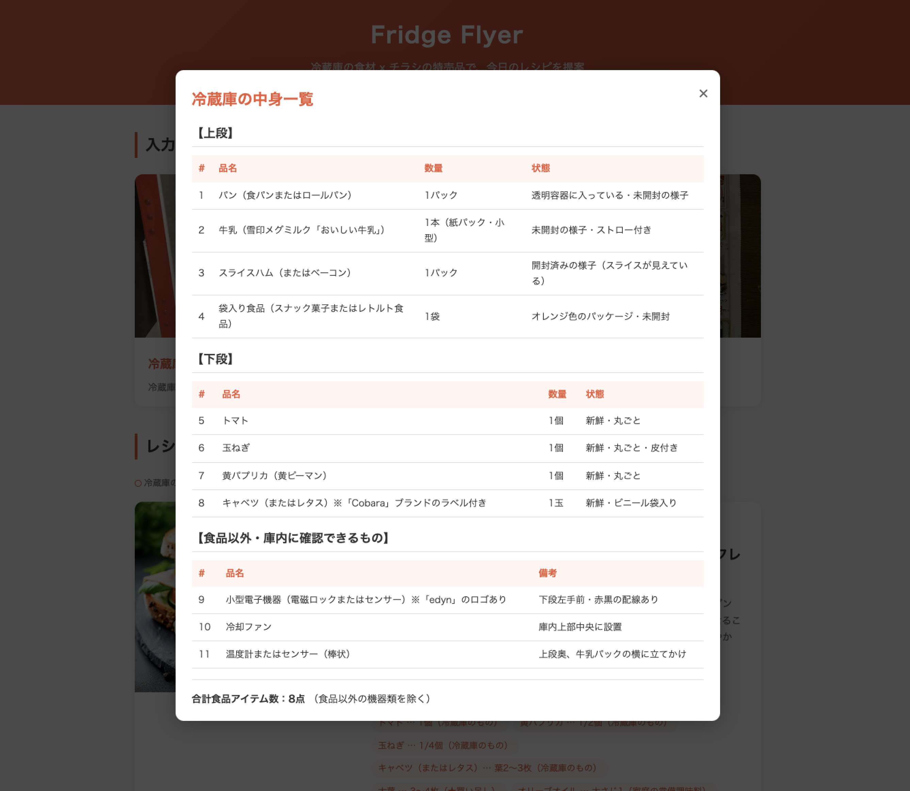
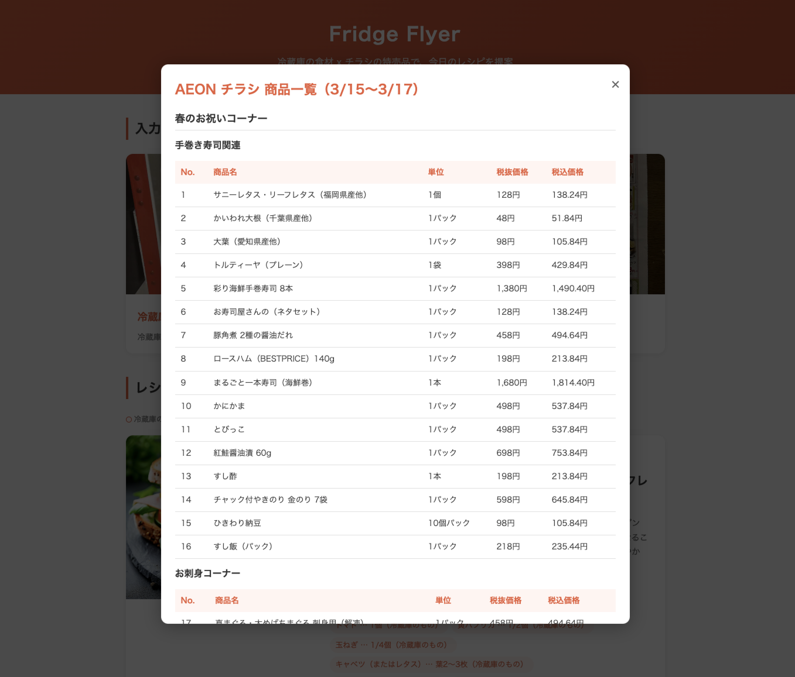

# FridgeFlyer

[日本語](README.ja.md)

A serverless application that suggests recipes using AI by analyzing refrigerator contents and supermarket flyer images.

## Overview

`FridgeFlyer` uses Amazon Bedrock Flows and Claude Opus 4.6's image recognition to:

1. **Analyze refrigerator contents** - Automatically recognize ingredients from refrigerator photos
2. **Extract sale items from flyers** - Extract product information from supermarket flyers
3. **Suggest recipes** - Generate 3 recipes combining refrigerator ingredients and sale items
4. **Generate recipe images** - Create completion images of dishes using Nova Canvas
5. **Output as HTML** - Automatically generate easy-to-read recipe pages

## Features

- **AI Image Analysis**: High-precision ingredient and product extraction using Claude Opus 4.6
- **Recipe Generation**: Recipe suggestions that maximize refrigerator ingredients with minimal additional purchases
- **Image Generation**: Dish completion images using Nova Canvas
- **HTML Output**: Automatic generation of responsive recipe pages
- **Infrastructure as Code**: Deploy with AWS CDK (TypeScript)
- **Serverless Architecture**: Scalable configuration using Lambda and Bedrock Flows

## Architecture



## Prerequisites

- AWS CLI configured with appropriate credentials
- Node.js 18.x or later
- Python 3.10 or later (with boto3 installed)
- AWS CDK CLI (`npm install -g aws-cdk`)
- Bedrock model access enabled for Claude in your AWS account

## Installation

```bash
git clone https://github.com/your-username/fridge-flyer.git
cd fridge-flyer/cdk
npm install
```

## Deployment

```bash
cd cdk

# First time only: Bootstrap CDK
cdk bootstrap

# Deploy the stack
cdk deploy
```

### Updating Flow Version (After Redeployment)

After redeploying CDK, you need to create a new Flow version and update the Alias:

**cdk/update_alias.sh**

```bash
# Get Flow ID
FLOW_ID=$(aws cloudformation describe-stacks \
  --stack-name FridgeFlyerStack \
  --query "Stacks[0].Outputs[?OutputKey=='FlowId'].OutputValue" \
  --output text)

ALIAS_ID=$(aws cloudformation describe-stacks \
  --stack-name FridgeFlyerStack \
  --query "Stacks[0].Outputs[?OutputKey=='FlowAliasId'].OutputValue" \
  --output text)

# Create new version
VERSION=$(aws bedrock-agent create-flow-version \
  --flow-identifier "$FLOW_ID" \
  --query "version" \
  --output text)

# Update Alias to new version
aws bedrock-agent update-flow-alias \
  --flow-identifier "$FLOW_ID" \
  --alias-identifier "$ALIAS_ID" \
  --name live \
  --routing-configuration "[{\"flowVersion\":\"$VERSION\"}]"

echo "Flow updated to version $VERSION"
```


## Usage

### Quick Start (Recommended)

You can easily generate recipes using the Python script.

#### 1. Prepare Images

Place the following images in the `recipe/` directory:
- `flyer.jpg` - Supermarket flyer image
- `fridge.jpg` - Refrigerator contents image

#### 2. Configure the Script

Update the constants in `recipe/generate_recipe.py` according to your environment:

```python
FLOW_ID = "<FlowId from CloudFormation output>"
FLOW_ALIAS_ID = "<FlowAliasId from CloudFormation output>"
BUCKET_NAME = "fridge-flyer-<your-account-id>"
```

You can find the Flow ID and Alias ID with:
```bash
aws cloudformation describe-stacks \
  --stack-name FridgeFlyerStack \
  --query "Stacks[0].Outputs" \
  --output table
```

#### 3. Run the Script

```bash
cd recipe
python3 generate_recipe.py
```

#### 4. Check the Output

When processing completes, the recipe page automatically opens in your browser.

Generated files:
| File | Description |
|------|-------------|
| `recipe/results/result.md` | Generated recipes (Markdown) |
| `recipe/results/recipe_dish1.png` | Generated image for Dish 1 |
| `recipe/results/recipe_dish2.png` | Generated image for Dish 2 |
| `recipe/results/recipe_dessert.png` | Generated image for Dessert |
| `recipe/output/index.html` | Recipe page (HTML) |

### Using AWS CLI

You can also invoke the Flow directly using AWS CLI without the Python script.

#### 1. Upload Images to S3

```bash
aws s3 cp flyer.jpg s3://fridge-flyer-<your-account-id>/
aws s3 cp fridge.jpg s3://fridge-flyer-<your-account-id>/
```

#### 2. Execute Bedrock Flow

```bash
FLOW_ID="<FlowId from output>"
ALIAS_ID="<FlowAliasId from output>"

aws bedrock-agent-runtime invoke-flow \
  --region ap-northeast-1 \
  --flow-identifier "$FLOW_ID" \
  --flow-alias-identifier "$ALIAS_ID" \
  --inputs '[{"content":{"document":"start"},"nodeName":"FlowInputNode","nodeOutputName":"document"}]'
```

#### 3. Check Results

```bash
aws s3 ls s3://fridge-flyer-<your-account-id>/results/
aws s3 sync s3://fridge-flyer-<your-account-id>/results/ ./results/
```

## Output Files

### Files Saved to S3

| File | Description |
|------|-------------|
| `results/flyer_description.json` | Product list extracted from supermarket flyer |
| `results/fridge_description.json` | Contents list extracted from refrigerator |
| `results/recipe_dish1.png` | Generated image for Dish 1 |
| `results/recipe_dish2.png` | Generated image for Dish 2 |
| `results/recipe_dessert.png` | Generated image for Dessert |

### JSON Output Format

```json
{
  "source_bucket": "fridge-flyer-123456789012",
  "source_key": "flyer.jpg",
  "description": "Product list extracted from the flyer...",
  "model_id": "global.anthropic.claude-opus-4-6-v1"
}
```

* Generated HTML Review (Top)



* Generated HTML Review (Middle)



* Generated HTML Review (Bottom)



* Generated HTML Review (Refrigerator Contents List)



* Generated HTML Review (Flyer Contents List)



## Configuration

Edit `cdk/lib/fridge-flyer-stack.ts` to customize:

| Parameter | Description | Default |
|-----------|-------------|---------|
| `MODEL_ID` | Claude model for image analysis | `global.anthropic.claude-opus-4-6-v1` |
| `IMAGE_MODEL_ID` | Image generation model | `amazon.nova-canvas-v1:0` |
| `bucketName` | S3 bucket name pattern | `fridge-flyer-${ACCOUNT_ID}` |
| `temperature` | Recipe generation diversity | `0.9` |
| `timeout` | Lambda function timeout | ImageProcessor: 10min, ImageGenerator: 5min |

## Project Structure

```
fridge-flyer/
├── cdk/
│   ├── bin/cdk.ts                    # CDK app entry point
│   ├── lib/fridge-flyer-stack.ts     # Main stack definition
│   ├── lambda/
│   │   ├── image-processor/          # Image analysis Lambda (Claude Opus)
│   │   │   └── index.py              # Flyer & refrigerator image analysis
│   │   ├── image-generator/          # Recipe image generation Lambda (Nova Canvas)
│   │   │   └── index.py              # Dish image generation
│   │   └── merge-node/               # Merge node Lambda
│   │       └── index.py              # Parallel processing sync (no LLM)
│   ├── update_alias.sh               # Flow Alias update script
│   ├── package.json
│   ├── tsconfig.json
│   └── cdk.json
├── recipe/
│   ├── generate_recipe.py            # Recipe generation script
│   ├── flyer.jpg                     # Flyer image (input)
│   ├── fridge.jpg                    # Refrigerator image (input)
│   ├── flyer_001.jpg ~ flyer_009.jpg # Sample flyer images
│   ├── fridge_001.jpg ~ fridge_006.jpg # Sample refrigerator images
│   ├── results/                      # Generation results
│   └── output/                       # HTML output
├── images/
│   ├── bedrock-flow-architecture.drawio  # Architecture diagram (editable)
│   └── bedrock-flow-architecture.png     # Architecture diagram
├── README.md
├── README.ja.md
└── LICENSE
```

## Requirements

- Python 3.10 or later (boto3, Pillow)
- Node.js 18.x+
- AWS CDK 2.x
- AWS Account with Bedrock access
  - Claude Opus 4.6 (global inference) - Image analysis & recipe generation
  - Nova Canvas - Dish image generation

## License

MIT License - see [LICENSE](LICENSE) for details.

## Author

SIN

## Contributing

Pull requests are welcome. For major changes, please open an issue first to discuss what you would like to change.
